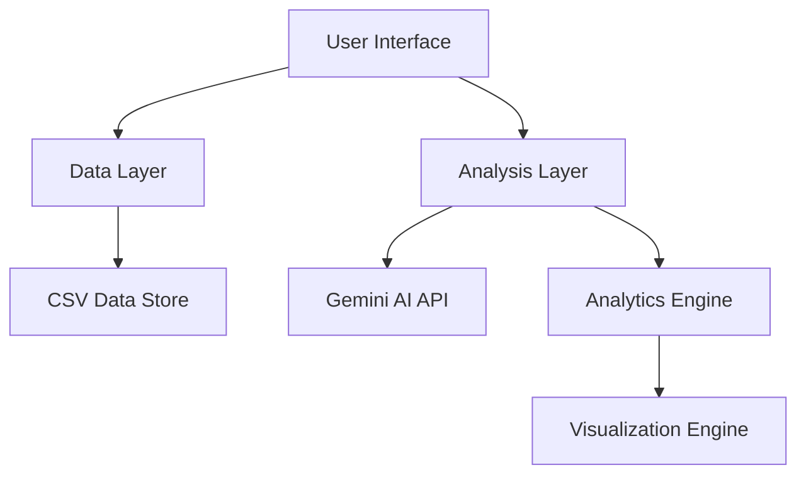
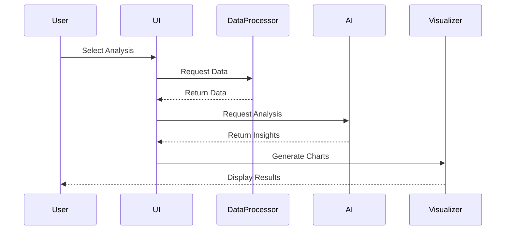

# AI-Powered Project Management Analytics System
## Complete Project Documentation

# Table of Contents
1. [Project Overview](#1-project-overview)
2. [Technical Architecture](#2-technical-architecture)
3. [Implementation Details](#3-implementation-details)
4. [Code Base](#4-code-base)
5. [Setup and Installation](#5-setup-and-installation)

## 1. Project Overview

### 1.1 Executive Summary
The AI-Powered Project Management Analytics System integrates Google's Gemini Pro AI with project management data to provide intelligent insights for:
- Predictive Scheduling
- Resource Optimization
- Risk Assessment

### 1.2 Project Structure
```plaintext
project/
├── main.py
├── .env
├── requirements.txt
├── README.md
├── project_data.csv
├── .gitignore
```

## 2. Technical Architecture

### 2.1 System Components


### 2.2 Data Flow


## 3. Implementation Details

### 3.1 Core Files

#### app.py
```python
import os
import streamlit as st
import pandas as pd
import google.generativeai as genai
import plotly.express as px
from dotenv import load_dotenv

# Load environment variables
load_dotenv()
GOOGLE_API_KEY = os.getenv("GOOGLE_API_KEY")
genai.configure(api_key=GOOGLE_API_KEY)
model = genai.GenerativeModel('gemini-pro')

class ProjectAnalytics:
    def __init__(self, df):
        self.df = df
        self.model = model

    def analyze_timeline(self, project_id):
        project_data = self.df[self.df['Project_ID'] == project_id]
        
        prompt = f"""
        Analyze this project timeline data:
        Tasks: {project_data['Task_Name'].tolist()}
        Estimated Days: {project_data['Estimated_Days'].tolist()}
        Actual Days: {project_data['Actual_Days'].tolist()}
        
        Provide:
        1. Timeline prediction based on historical data
        2. Potential delays and bottlenecks
        3. Schedule optimization suggestions
        """
        
        response = self.model.generate_content(prompt)
        return response.text

    def optimize_resources(self, project_id):
        project_data = self.df[self.df['Project_ID'] == project_id]
        
        prompt = f"""
        Analyze resource data:
        Resources: {project_data['Resource_Allocated'].tolist()}
        Efficiency: {project_data['Efficiency'].tolist()}
        Idle Time: {project_data['Idle_Time'].tolist()}
        
        Provide:
        1. Resource utilization recommendations
        2. How to minimize idle time
        3. Efficiency improvement suggestions
        """
        
        response = self.model.generate_content(prompt)
        return response.text

    def assess_risks(self, project_id):
        project_data = self.df[self.df['Project_ID'] == project_id]
        
        prompt = f"""
        Analyze project risks:
        Risk Types: {project_data['Risk_Type'].tolist()}
        Likelihood: {project_data['Likelihood'].tolist()}
        Impact: {project_data['Impact_Level'].tolist()}
        
        Provide:
        1. Risk assessment summary
        2. Mitigation strategies
        3. Priority recommendations
        """
        
        response = self.model.generate_content(prompt)
        return response.text

def load_data():
    try:
        df = pd.read_csv('data/project_data.csv')
        return df
    except Exception as e:
        st.error(f"Error loading data: {e}")
        return None

def main():
    st.title("Project Management Analytics")
    
    df = load_data()
    if df is None:
        st.stop()
    
    analytics = ProjectAnalytics(df)
    
    analysis_type = st.sidebar.selectbox(
        "Select Analysis",
        ["Predictive Scheduling", "Resource Optimization", "Risk Assessment"]
    )
    
    selected_project = st.selectbox("Select Project", df['Project_ID'].unique())
    
    if analysis_type == "Predictive Scheduling":
        st.header("Predictive Scheduling")
        if st.button("Analyze Timeline"):
            with st.spinner("Analyzing..."):
                project_df = df[df['Project_ID'] == selected_project]
                fig = px.bar(project_df, 
                           x='Task_Name',
                           y=['Estimated_Days', 'Actual_Days'],
                           title="Task Duration Analysis",
                           barmode='group')
                st.plotly_chart(fig)
                
                analysis = analytics.analyze_timeline(selected_project)
                st.subheader("AI Insights")
                st.write(analysis)
    
    elif analysis_type == "Resource Optimization":
        st.header("Resource Optimization")
        if st.button("Optimize Resources"):
            with st.spinner("Analyzing..."):
                project_df = df[df['Project_ID'] == selected_project]
                
                fig = px.scatter(project_df,
                               x='Efficiency',
                               y='Idle_Time',
                               color='Resource_Allocated',
                               title="Resource Utilization Analysis")
                st.plotly_chart(fig)
                
                optimization = analytics.optimize_resources(selected_project)
                st.subheader("Optimization Recommendations")
                st.write(optimization)
    
    else:  # Risk Assessment
        st.header("Risk Assessment")
        if st.button("Assess Risks"):
            with st.spinner("Analyzing..."):
                project_df = df[df['Project_ID'] == selected_project]
                
                fig = px.scatter(project_df,
                               x='Likelihood',
                               y='Impact_Level',
                               color='Risk_Type',
                               title="Risk Matrix")
                st.plotly_chart(fig)
                
                risk_analysis = analytics.assess_risks(selected_project)
                st.subheader("Risk Assessment")
                st.write(risk_analysis)

if __name__ == "__main__":
    main()
```

### 3.2 Requirements
```plaintext
# requirements.txt
streamlit==1.24.0
pandas==2.0.3
google-generativeai==0.1.0
plotly==5.15.0
python-dotenv==1.0.0
```

### 3.3 Environment Variables
```plaintext
# .env
GOOGLE_API_KEY=your_api_key_here
```

## 4. Setup and Installation

### 4.1 Prerequisites
- Python 3.8 or higher
- pip package manager
- Google Cloud account with Gemini API access

### 4.2 Installation Steps
```bash
# Clone repository
git clone <repository-url>
cd project-management-analytics

# Create virtual environment
python -m venv venv
source venv/bin/activate  # Unix
venv\Scripts\activate     # Windows

# Install dependencies
pip install -r requirements.txt

# Set up environment variables
# Create .env file and add your Google API key

# Run the application
streamlit run app.py
```

## 5. Data Structure

### 5.1 Required CSV Columns
```plaintext
- Project_ID: Unique identifier for each project
- Task_Name: Name of project tasks
- Estimated_Days: Planned duration
- Actual_Days: Actual duration
- Resource_Allocated: Assigned resources
- Efficiency: Resource efficiency metrics
- Idle_Time: Resource idle time
- Risk_Type: Type of project risks
- Likelihood: Risk probability
- Impact_Level: Risk impact severity
```

### 5.2 Sample Data Format
```csv
Project_ID,Task_Name,Estimated_Days,Actual_Days,...
P001,Task1,10,12,...
P001,Task2,15,14,...
```
